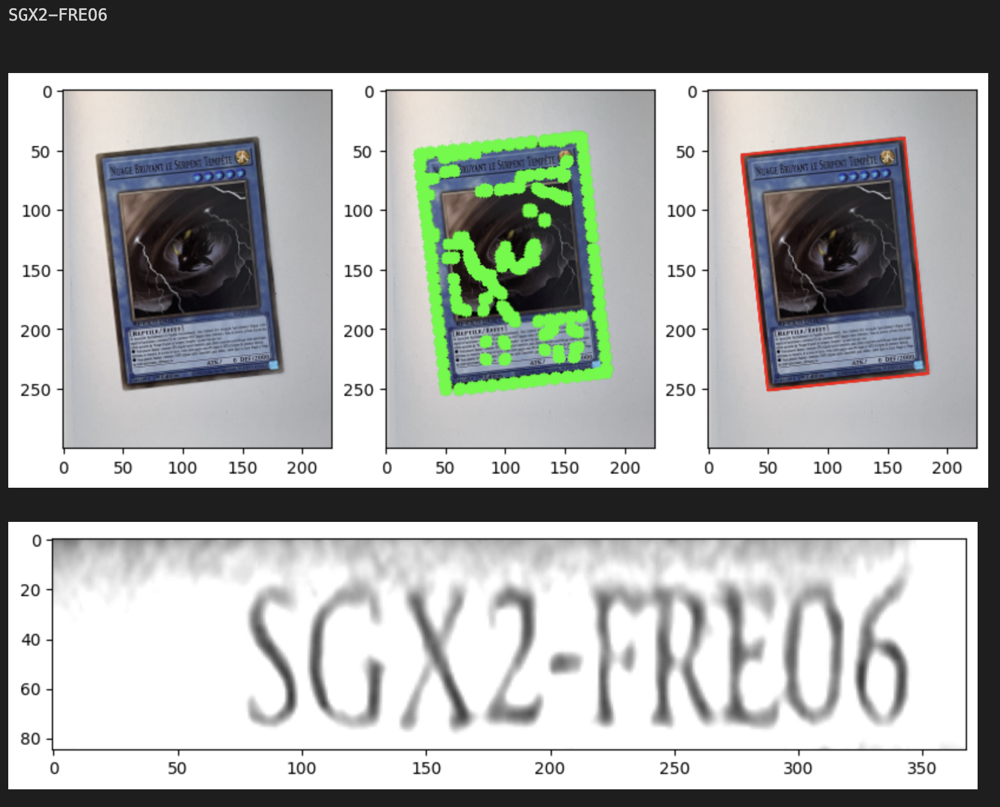
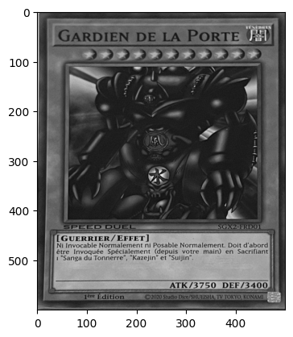

# YuGiOh_Card_Detector

[Note: The code uplaoded is still in DRAFT and not cleanned. The code runs but it's kind ugly, it will bue updated when I have time]

Detects Yu-Gi-Oh! card using OCR and DNN

The idea is upload a card picture as an input and generate the konami ID of the card as a string. 

# STEP 1 - DETECT THE CARD 

Open CV is used to detect the card corner and warp the image to get a clean top view of the card as displayed below.

# STEP 2 - CROP THE IMAGE AND DETECT KONAMI ID

We crop the image in a specific area where the konami code is always printed and then we use open CV Deep Neura Network to detect text in this area. 

# STEP 3 - APPLY OCR

OCR is used on the bounding box around the Konami ID and then the result is extract in str type.

